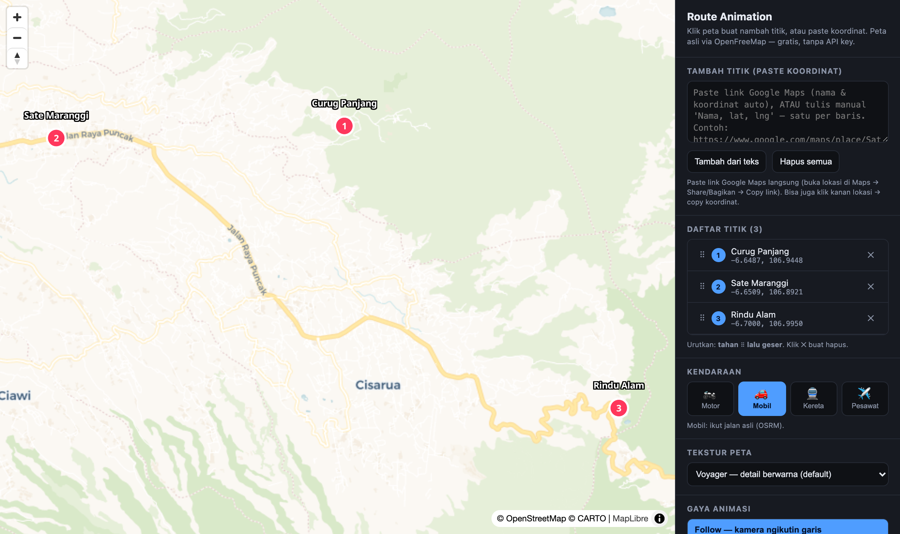

# Map Route Animation

Tool web sederhana buat bikin **animasi rute point-to-point** di atas peta asli — mirip AnimateMyMap, tapi gratis, tanpa API key, dan jalan langsung di browser (satu file HTML).

Dibangun pakai **MapLibre GL JS** + basemap raster gratis (CARTO / OSM / Esri / OpenTopoMap) + **OSRM** buat routing jalan asli.

## Fitur

- 🗺️ **Peta jalan asli** — 6 tekstur: Voyager, Light, Dark, Satellite, OSM, Topo (tinggal pilih, ganti instan)
- 📍 **Tambah titik** — paste **link Google Maps** (nama + koordinat diekstrak otomatis) atau ketik `Nama, lat, lng`, atau klik langsung di peta
- ↕️ **Urutkan ulang** titik dengan drag-and-drop
- 🚗 **Pilih kendaraan** — Motor / Mobil (ikut jalan asli via OSRM) · Kereta (garis lurus) · Pesawat (garis lengkung). Ikon kendaraannya jalan di sepanjang rute
- 🎬 **Gaya animasi** — Follow · Cinematic 3D (kamera miring + muter) · Overview
- 🎚️ Atur kecepatan, zoom, dan kemiringan (pitch) kamera
- ⏺️ **Record ke video** (WebM/MP4) langsung dari browser — tanpa server render
- ⏹️ Batalin animasi kapan aja

## Cara pakai

1. Buka `map-animation.html` di browser (paling stabil di **Google Chrome**).
2. Paste koordinat / link Google Maps → **Tambah dari teks** (atau klik peta).
3. Titik muncul di **Daftar titik** → drag **⠿** buat urutkan, **✕** buat hapus.
4. Pilih kendaraan, tekstur peta, dan gaya animasi.
5. **▶ Play**. Mau download video? Klik **● Record** dulu → **Play** → **■ Stop & Save**.

### Ambil koordinat dari Google Maps
Buka lokasi di Google Maps → klik kanan → koordinat muncul, tinggal copy. Atau copy URL panjang lokasi (yang ada `@lat,lng` dan `!3d!4d`) — tool-nya ekstrak sendiri.

## Catatan

- Routing "ikut jalan asli" pakai server demo publik OSRM (kadang lambat/rate-limit). Kalau gagal, otomatis fallback ke garis lurus.
- Semua data peta gratis & open. Kredit: © OpenStreetMap, © CARTO, Esri, OpenTopoMap.

## Teknologi

Vanilla HTML/JS — [MapLibre GL JS](https://maplibre.org/), [Turf.js](https://turfjs.org/), [OSRM](http://project-osrm.org/), [OpenFreeMap fonts](https://openfreemap.org/).

## Lisensi

MIT
